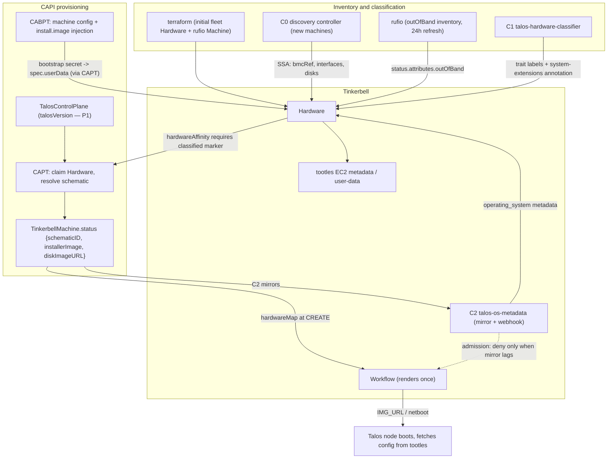

# Architecture — Talos + Tinkerbell Runtime Hook Glue

Status: Proposed — 2026-09-01

This repository is re-scoped from a single-purpose BMC discovery controller into a collection of
independently deployable glue components that close the Talos lifecycle gaps in a Tinkerbell-backed
Cluster API (CAPI) environment: platform-aware extension selection, OS image metadata on Hardware
before workflows render, `talosctl`-like teardown on every machine deletion path, hygiene for
released hardware, and the cluster-scoped remainder of `talosctl upgrade-k8s`. This document is the
system-level contract all component docs point to: it records the governing facts, the mechanism
decision (why this repo uses machine deletion phase hooks, plain controllers, and admission
webhooks instead of the CAPI Runtime SDK hooks the original brief assumed), the field-ownership
matrix, the environment preconditions P1–P7, the naming standard, and the shared deployment and
testing strategy.

## Overview

### The problem

The homelab platform provisions Talos Linux clusters on bare metal through Tinkerbell, driven by
CAPI with three forked providers: CAPT (`tinkerbell-community/cluster-api-provider-tinkerbell`,
infrastructure), CABPT (`sidero-community/cluster-api-bootstrap-provider-talos`, bootstrap +
in-place update extension), and CACPPT (`sidero-community/cluster-api-control-plane-provider-talos`,
control plane). Terraform (`tfc/cluster-bootstrap`) creates the cluster objects, one bootstrap node
outside CAPI, the Hardware/BMC inventory for the initial fleet, and the CAPI identity secrets.

The stack works, but it manages machines the way Tinkerbell manages generic servers, not the way
`talosctl` manages Talos nodes. Verified gaps (evidence in the research dossiers accompanying the
charter):

- Nothing selects Talos system extensions from observed hardware; the schematic annotation contract
  exists in the CAPT fork but has no automated writer.
- Nothing populates `Hardware.spec.metadata.instance.operating_system`, which feeds both the
  deployed workflow template's `IMG_URL` and tootles' EC2 metadata (tinkerbell repo,
  `tootles/internal/frontend/ec2/routes.go:11-117`); terraform writes it once at apply time.
- Machine deletion is power-off only: CAPT's delete path removes the Template and Workflow CRs,
  runs one rufio `PowerHardOff` job, and releases the Hardware — no etcd leave, no Talos reset or
  disk wipe, no Node deletion, and `Hardware.spec.userData` (a secret-bearing Talos machine config)
  is never cleared (CAPT `controller/machine/scope.go:292-368`, `hardware.go:347-365`).
- CACPPT leaves etcd gracefully only on its own scale-down path, and its `etcd-leaving` annotation
  is stamped before the leave runs; a failed leave is silently swallowed (CACPPT
  `controllers/scale.go:145-165`).
- The cluster-scoped half of `talosctl upgrade-k8s` — bootstrap-manifest SSA sync and v1.13
  pruning — has no owner anywhere.
- The existing discovery controller in this repo rewrites the full Hardware spec hourly, erasing
  every other writer's fields (this repo, `internal/sync/syncer.go:84-124`).

### The shape of the solution

Six components in one Go module, each independently deployable with its own binary, Helm chart, and
RBAC, interacting **only** through the API server via the contracts in this document. Every writer
uses server-side apply (SSA) with a field manager named after the component, with three recorded
exceptions (C4's resourceVersion-guarded Updates on Hardware, C3's patch-helper annotation writes
on Machines, and C5's foreign-contract `talos` manager on workload manifests):

- **C0** — `tinkerbell-bmc-discovery-controller` (existing, in-scope change): migrate the Hardware
  upsert to SSA so discovery stops erasing foreign fields.
- **C1** — `talos-hardware-classifier`: derive platform traits and Talos extension selection per
  Hardware from rufio out-of-band inventory.
- **C2** — `talos-os-metadata`: mirror the CAPT-resolved image identity into Hardware OS metadata
  before workflows render, enforced by an opt-in validating admission webhook on Workflow CREATE.
- **C3** — `talos-machine-teardown`: the one machine-deletion-phase hook implementer — etcd
  leave and Talos reset at the pre-terminate checkpoint, on every deletion path, strictly before
  CAPT powers the machine off.
- **C4** — `tinkerbell-hardware-janitor`: hygiene for released Hardware (clear `userData`, clear
  stale OS metadata, restore baseline netboot posture), catching paths where C3 never ran.
- **C5** — `talos-upgrade-coordinator`: bootstrap-manifest SSA sync after cluster-wide version
  convergence — the remainder of `talosctl upgrade-k8s` that is not per-node work.

No component introduces a CRD. No component registers a CAPI Runtime SDK hook (see the mechanism
decision below). No component re-resolves Image Factory schematics (that is CAPT's job), generates
or applies Talos machine configs (CABPT's job), or triggers machine-level upgrades (the
CABPT/CACPPT in-place pipeline's job).

### Mechanism decision

**The original brief assumed CAPI Runtime SDK lifecycle hooks and topology mutation hooks. Those
mechanisms can never fire in this environment, and this repo deliberately does not use them.**
This is the single most important design fact in the repository, so it is stated bluntly:

- **Cluster lifecycle hooks (`BeforeClusterCreate`, `BeforeClusterDelete`, `BeforeClusterUpgrade`,
  etc.) are invoked only by the topology (ClusterClass) controller.** Its watch is filtered on
  `predicates.ClusterHasTopology` and its `Reconcile` returns early for clusters without
  `spec.topology` (cluster-api v1.13.0
  `internal/controllers/topology/cluster/cluster_controller.go:115,280`); even the core Cluster
  controller's `BeforeClusterDelete` gate is wrapped in `cluster.Spec.Topology.IsDefined()`
  (`internal/controllers/cluster/cluster_controller.go:334-341`). The terraform-created cluster has
  no ClusterClass and no `spec.topology`, so **no lifecycle hook will ever be called**. Upstream
  tracks this as a known limitation: kubernetes-sigs/cluster-api issue #11491.
- **Topology mutation hooks require a ClusterClass and can only patch ClusterClass-referenced
  templates** — never a Tinkerbell Hardware object, even with topology enabled.
- **The in-place update hook surface is exclusively CABPT's.** Core CAPI hard-fails when more than
  one `UpdateMachine` extension is registered (cluster-api v1.13.0
  `internal/controllers/machine/machine_controller_inplace_update.go:145-156`), and CABPT already
  serves `can-update-machine`, `can-update-machine-set`, and `update-machine` by default (CABPT
  `internal/inplace/server.go:75-89`). A second registration from this repo would break in-place
  updates for the whole management cluster.

What **does** work without ClusterClass, and what this repo therefore uses:

1. **Machine deletion phase hook annotations**
   (`pre-drain.delete.hook.machine.cluster.x-k8s.io/<name>`,
   `pre-terminate.delete.hook.machine.cluster.x-k8s.io/<name>`) are implemented in the core Machine
   controller with no feature gate and no topology dependency; the controller blocks the deletion
   phase until the annotation is removed (cluster-api v1.13.0
   `internal/controllers/machine/machine_controller.go:494-508,591-605`). KCP's `kcp-cleanup`
   pre-terminate hook is the canonical precedent for etcd teardown. The slot is unoccupied here —
   CAPT neither sets nor reads any deletion hook annotation (zero grep matches across the fork).
2. **Plain controllers** watching Hardware, TinkerbellMachine, Machine, and TalosControlPlane.
3. **Admission webhooks on Tinkerbell CRDs.** Workflows render exactly once, at tink-controller's
   first reconcile when `status.state == ""` (tinkerbell repo
   `tink/controller/internal/workflow/reconciler.go:146-159`) — there is no in-stack blocking
   point, but denying the Workflow CREATE fully prevents the render, and CAPT retries denied
   creates with clean exponential backoff and no terminal state.

Because no component serves a Runtime SDK hook, the repo needs **no ExtensionConfig or registry
machinery at all** — deliberately avoiding the registry-warmup crash-loop (a non-discoverable
ExtensionConfig crash-loops the entire core CAPI manager after 60s, cluster-api v1.13.0
`internal/controllers/extensionconfig/warmup.go:60-88`) and the self-registration burden that
ExtensionConfig's cert-manager-incompatible CA injection forces on CABPT.

| Gap | Mechanism chosen | Why the alternatives are unusable |
| --- | --- | --- |
| OS/image metadata on Hardware before workflow render | C2: mirror controller + opt-in validating webhook on Workflow CREATE | `BeforeClusterCreate` never fires without ClusterClass (#11491); the tink stack has no admission or readiness gate of its own; workflows render once at first reconcile, so CREATE denial is the only enforcement point |
| Platform-aware extension selection | C1: plain controller writing labels/annotations into CAPT's existing schematic contract | Topology mutation hooks need ClusterClass and cannot patch Hardware; per-machine TalosConfig mutation is blocked by CABPT's immutability webhook and CACPPT's verbatim stamping |
| etcd leave + Talos reset before power-off | C3: `pre-terminate` machine deletion phase hook annotation | `BeforeClusterDelete` is topology-only; CAPT honors no deletion hooks; pre-terminate is the only CAPI-native, blocking, per-machine checkpoint that works without topology, and CAPT teardown starts strictly after it clears |
| Released-hardware hygiene | C4: plain controller on Hardware | The tink stack has no finalizers, no Hardware controller, and no release event; only observed state can trigger cleanup |
| Cluster-scoped k8s upgrade remainder | C5: plain controller performing bootstrap-manifest SSA sync | `BeforeClusterUpgrade`/`AfterClusterUpgrade` never fire without topology; per-node work is CABPT's exclusive in-place surface |
| Multi-writer corruption on Hardware | C0: SSA field-manager migration of the existing discovery controller | SSA discipline in new components is useless while any co-writer performs full-spec non-SSA updates — a plain `Update` takes ownership of and overwrites all fields regardless of other managers |

ClusterClass adoption remains a documented future option (see Future work) — never a dependency.

## Governing facts

These are the verified facts (F1–F10 in the charter) every component design rests on. Evidence
lives in the charter's research dossiers; the most load-bearing citations are repeated here.

1. **F1 — No ClusterClass, no lifecycle/topology hooks, ever.** Usable mechanisms: deletion phase
   hook annotations, plain controllers, admission webhooks (see Mechanism decision above).
2. **F2 — CAPT owns schematic resolution.** The CAPT fork resolves Image Factory schematics per
   machine from hardware signals united with the `talos.tinkerbell.org/system-extensions`
   annotation (read from **both** Hardware and TinkerbellMachine), publishes
   `TinkerbellMachine.status.{schematicID,installerImage,diskImageURL}` (served at `v1beta2`), and
   injects the trio into `Workflow.spec.hardwareMap` at CREATE (CAPT
   `controller/machine/schematic.go:31-131`, `workflow.go:128-146`). CABPT reads
   `status.installerImage` generically and injects `machine.install.image` ahead of user
   strategicPatches, folding it into the in-place config hash (CABPT
   `controllers/installer_image.go:20-82`). **This repo must never re-resolve schematics.** The
   pipeline is, however, inert or deficient in the deployed environment until P1–P3 land.
3. **F3 — In-place hooks are exclusively CABPT's; CACPPT implements the control-plane owner half**
   (one machine at a time, etcd-health-gated). This repo registers no Runtime SDK hooks and never
   drives `ApplyConfiguration` or `Upgrade` on managed machines. Per-node config apply and Talos OS
   upgrade are covered by that pipeline **only once P3 is fixed**.
4. **F4 — Teardown gaps confirmed.** CAPT delete: Template CR + Workflow CR deletion, one rufio
   `PowerHardOff` job, hardware release. No etcd leave, no reset/wipe, no Node delete, `userData`
   not cleared. CACPPT's graceful etcd leave exists only on its own scale-down, and its
   `etcd-leaving` annotation means "leave **attempted**", not done (stamped before the leave; a
   failed leave is swallowed by the `scale.go:163-165` nil-err bug). Pre-terminate hooks still gate
   infra deletion during whole-cluster delete (pre-drain/drain are skipped then). CAPT teardown
   begins only at `TinkerbellMachine.deletionTimestamp`, which CAPI sets strictly **after** all
   pre-terminate hooks clear — so C3's work strictly precedes power-off.
5. **F5 — Hardware OS metadata has no writer; workflows render once.** Rendering happens at
   tink-controller's first reconcile, not at admission — but denying CREATE fully prevents it, and
   CAPT retries denied creates with exponential backoff (no terminal state; the schematic status
   trio persists via CAPT's deferred patch even on the denied path). CAPT-owned Workflows carry
   labels `capt.tinkerbell.org/machine-name|machine-namespace` before Create; auto-enrollment
   workflows are unlabeled. CAPT does **not** watch Hardware, so post-denial retrigger is
   backoff-only.
6. **F6 — Rufio out-of-band inventory** (`Hardware.status.attributes.outOfBand`, incl.
   `gpuDevices`) is the only pre-render hardware signal; 24h jittered refresh, forceable via the
   annotation `tinkerbell.org/refresh-inventory=true`. This fleet's BMCs (Pi-class OpenBMC, ASRock
   Rack) may not report GPUs — detection is **best-effort**; the manual annotation is the
   authoritative override.
7. **F7 — The cluster-scoped remainder of `talosctl upgrade-k8s`** is bootstrap-manifest SSA sync
   (+ v1.13 pruning). `PerformManifestsSync` is exported and importable; kube-proxy image updates
   are per-node machine-config patches (CABPT's domain) and moot here anyway (Cilium
   `kubeProxyReplacement`, no kube-proxy).
8. **F8 — No Runtime SDK hook served → no ExtensionConfig machinery needed.** C2's webhook uses
   cert-manager; cainjector works fine for `ValidatingWebhookConfiguration` (unlike
   ExtensionConfig).
9. **F9 — Repo conventions:** single Go module, `cmd/<binary>` per component, `internal/<pkg>`,
   `helm/<chart>` per deployable, goreleaser multi-build scratch images, strict golangci, slog
   factory. New needs: first TLS machinery (cert-manager), first ClusterRole RBAC (CAPI objects),
   SSA field-manager discipline.
10. **F10 — Feature gates confirmed enabled** in the deployed environment: core CAPI
    `RuntimeSDK=true` + `InPlaceUpdates=true`, CACPPT `InPlaceUpdates` — the in-place pipeline is
    live (terraform `modules/core/modules/cluster-api-operator/locals.tf:15-66`).

## System context

All components run on the management cluster (which, in this environment, is the self-managed
workload cluster terraform bootstraps). The actors:

- **terraform** (`tfc/cluster-bootstrap`): creates the CAPI Cluster/TinkerbellCluster/
  TinkerbellMachineTemplate/TalosControlPlane (no ClusterClass), one bootstrap node entirely
  outside CAPI, Hardware + rufio Machine objects for the initial fleet, and the CAPI identity
  secrets (`<cluster>-talos`, `<cluster>-talosconfig`, `<cluster>-kubeconfig`, `<cluster>-ca`).
- **C0 discovery controller** (this repo): mDNS-discovers BMCs, upserts rufio Machine + auth
  Secret + Hardware for new machines.
- **rufio**: collects out-of-band inventory into `Hardware.status.attributes.outOfBand` and
  executes power/boot-device/virtual-media jobs.
- **C1** classifies Hardware from that inventory (trait labels + the extensions annotation).
- **CAPT** claims Hardware via `hardwareAffinity`, writes the CABPT bootstrap config into
  `Hardware.spec.userData` (substituting `PROVIDER_ID`), resolves the schematic → status trio →
  creates Template + Workflow with the trio in `hardwareMap`.
- **C2** mirrors the trio into `Hardware.spec.metadata.instance.operating_system` and (opt-in)
  gates Workflow CREATE on that mirror being current.
- **tink controller** renders the Workflow exactly once, drives netboot BMC jobs, and toggles
  `netboot.allowPXE` true during PREPARING and false during POST.
- **smee/tootles** serve iPXE and EC2-style metadata; the node fetches its machine config from
  tootles `user-data` (backed by `Hardware.spec.userData`, keyed by source IP).
- **CABPT/CACPPT** generate configs, run the in-place update pipeline, and manage the control
  plane (including scale-down etcd leave).
- **C3, C4, C5** cover teardown, released-hardware hygiene, and post-upgrade manifest sync as
  described above.

The deletion path, in strict order (CAPI machine controller sequence, cluster-api v1.13.0
`internal/controllers/machine/machine_controller.go:465-660`):

1. Machine gets `deletionTimestamp`; pre-drain hooks wait; node is drained; volumes detach.
   (During whole-cluster delete, drain and pre-drain are skipped; pre-terminate still gates.)
2. **Pre-terminate wait — C3 acts here**: verify-then-act etcd membership handling for control
   plane nodes, then Talos `Reset` (wipe `STATE` + `EPHEMERAL`, halt), then C3 removes its
   annotation.
3. CAPI deletes the TinkerbellMachine → CAPT deletes Template + Workflow CRs, runs the rufio
   `PowerHardOff` job, releases the Hardware (owner labels, provisioned annotation, finalizers).
4. **C4 observes released Hardware**: clears `spec.userData`, clears stale OS metadata and
   instance state, re-asserts baseline netboot posture.
5. CAPI deletes the BootstrapConfig and finally the Node object.

## Ownership matrix

Every contested object/field has exactly one writer per state. All components in this repo write
via SSA with the field manager named after the component (the Naming standard makes this binding).
External actors are marked; their write mechanisms are noted where they are not SSA.

| Object / field | Sole writer | Field manager / mechanism |
| --- | --- | --- |
| Hardware `spec.bmcRef`, `spec.agentID`, `spec.interfaces[]` (MAC, hostname, DHCP), `spec.disks`, `spec.metadata.instance.id`, `spec.metadata.instance.hostname`, `spec.auto.enrollmentEnabled`, manufacturer/facility metadata | C0 for discovery-created Hardware; terraform for terraform-created Hardware (single-creator rule, P4) | `tinkerbell-bmc-discovery-controller` (SSA Apply); terraform via kubectl provider |
| Hardware `spec.interfaces[].netboot.allowPXE` | Creator sets the initial value once; tink workflow controller toggles during workflow lifecycle (true in PREPARING, false in POST); C4 re-asserts baseline **only in released state**. Post-C0, discovery still asserts the atomic `interfaces` list with the live netboot value carried forward — ownership of the list ping-pongs with tink-controller, but values stay stable | tink-controller (conflict-retry Update, external); `tinkerbell-hardware-janitor` (resourceVersion-guarded Update) |
| Hardware `spec.userData` | CAPT writes at claim (bootstrap config, `PROVIDER_ID` substituted); C4 clears after release; no other writer ever | CAPT (merge patch, external); `tinkerbell-hardware-janitor` |
| Hardware `spec.metadata.instance.operating_system` + instance state | C2 while Hardware is claimed; C4 clears on release (state-disjoint handoff); terraform must `ignore_changes` (P4) | `talos-os-metadata`; `tinkerbell-hardware-janitor` |
| Hardware labels `classify.tinkerbell.org/*` (trait labels, `classified` marker) | C1 | `talos-hardware-classifier` |
| Hardware annotation `talos.tinkerbell.org/system-extensions` | C1 is the **exclusive** writer on Hardware; user overrides go on the TinkerbellMachine-side annotation (CAPT unions both) | `talos-hardware-classifier` |
| Hardware annotation `classify.tinkerbell.org/last-applied-extensions` (three-way-merge companion) | C1 | `talos-hardware-classifier` |
| Hardware annotations `talos.tinkerbell.org/overlay`, `talos.tinkerbell.org/extra-kernel-args` (post-P2) | C1 (defaults from board traits); users may pre-set them, in which case C1 never overwrites | `talos-hardware-classifier` |
| rufio Machine annotation `tinkerbell.org/refresh-inventory` | C1 stamps on first sight of unclassified Hardware; rufio consumes and clears (foreign contract) | `talos-hardware-classifier`; rufio (external) |
| Hardware owner labels `v1alpha1.tinkerbell.org/ownerName\|ownerNamespace`, annotation `v1alpha1.tinkerbell.org/provisioned`, machine finalizers | CAPT exclusively (claim/release lifecycle) | CAPT (optimistic-lock merge patch, external) |
| Hardware labels/annotations `discovery.tinkerbell.org/*` (`managed-by`, `last-seen`, `mdns-*`) | C0 | `tinkerbell-bmc-discovery-controller` |
| Hardware label `tinkerbell.org/role` | terraform today; C1 only as an explicit, config-driven opt-in policy — never both for the same Hardware | terraform; `talos-hardware-classifier` |
| Hardware `status.attributes.outOfBand` | rufio inventory controller | rufio (status patch, external) |
| TinkerbellMachine `status.{schematicID,installerImage,diskImageURL}` | CAPT only; this repo reads, never writes | CAPT (external) |
| TinkerbellMachine annotation `talos.tinkerbell.org/system-extensions` | User / template author; components never write it | n/a |
| Machine annotation `pre-terminate.delete.hook.machine.cluster.x-k8s.io/talos-teardown` | C3 exclusively (adds while healthy, removes when teardown completes) | `talos-machine-teardown` |
| Machine annotation `controlplane.cluster.x-k8s.io/etcd-leaving` | CACPPT; C3 reads it as a **hint only** (means "attempted", never proof of completion) | CACPPT (external) |
| Machine annotations `in-place-updates.internal.cluster.x-k8s.io/update-in-progress`, `runtime.cluster.x-k8s.io/pending-hooks` | CACPPT (CP owner half) and core CAPI; read-only for this repo | external |
| Workflow objects (labels `capt.tinkerbell.org/machine-name\|machine-namespace`) | CAPT creates/deletes; C2's webhook may **deny CREATE** but never creates or mutates; tink controller owns `status` | CAPT, tink-controller (external) |
| Workflow objects (auto-enrollment, unlabeled) | tink server; never touched or blocked by this repo (webhook `objectSelector` excludes them) | tink server (external) |
| Template CRs | CAPT | CAPT (external) |
| rufio Job objects (`<machine>-poweroff`, `<machine>-inplace-recovery`, `netboot-<wf>`, `iso-*`) | CAPT and tink-controller respectively; this repo never creates BMC jobs | external |
| Workload-cluster Node deletion | CAPI machine controller (after infra removal) and CACPPT scale-down only; C3 and C5 abstain | external |
| Workload-cluster bootstrap manifests (Talos-rendered addons) | C5 via `PerformManifestsSync` SSA | `talos` (foreign contract shared with `talosctl upgrade-k8s`; also covers the `kube-system/talos-bootstrap-manifests-inventory` ConfigMap) |

Component-private keys — bookkeeping each component owns under its own domain, several of them
writes to foreign or shared objects, listed here so the matrix stays exhaustive:

| Object / key | Sole writer | Field manager / mechanism |
| --- | --- | --- |
| Machine annotations `teardown.tinkerbell.org/pre-terminate-observed-at`, `teardown.tinkerbell.org/etcd`, `teardown.tinkerbell.org/reset` (phase bookkeeping on a CAPI-owned object) | C3 | CAPI patch-helper merge patch, field owner `talos-machine-teardown` |
| Secret `talosconfig-<cluster-ns>-<cluster>` in C3's namespace (cached talosconfig — cluster-admin Talos credentials) | C3 | `talos-machine-teardown` (SSA) |
| Hardware annotation `janitor.tinkerbell.org/scrubbed-at` | C4 | `tinkerbell-hardware-janitor` (resourceVersion-guarded Update) |
| Hardware annotation `classify.tinkerbell.org/uncovered-traits` | C1 | `talos-hardware-classifier` |
| Hardware annotations `classify.tinkerbell.org/nvidia-flavor`, `classify.tinkerbell.org/nvidia-branch` | Operator-writable overrides; C1 reads, never writes | n/a (manual) |
| TalosControlPlane annotation `upgrade.tinkerbell.org/last-synced-version` (metadata-only write on a CACPPT/terraform-owned object) | C5 | `talos-upgrade-coordinator` (SSA metadata apply) |
| TalosControlPlane annotation `upgrade.tinkerbell.org/force-sync` | Human writes `"true"`; C5 consumes and removes | operator; `talos-upgrade-coordinator` |
| Workload ConfigMap `kube-system/talos-bootstrap-manifests-inventory` (SSA inventory) | C5 — a foreign contract shared with `talosctl upgrade-k8s` | `talos` |

Rules that follow from the matrix:

- A component may only write fields listed against its name, and only in the listed state
  (claimed vs. released Hardware is the recurring split — C2 and C4 are state-disjoint by design).
- C4 uses resourceVersion-guarded updates, never blind merge patches: the release → clear →
  new-claim → CAPT-userData-write sequence can interleave with a stale cache, and an unguarded
  clear landing after a new claim would boot a configless node.
- Foreign-contract keys (`talos.tinkerbell.org/*`, `tinkerbell.org/refresh-inventory`, the
  CAPI deletion hook annotation) keep their foreign domains; everything a component invents lives
  under its own `<function>.tinkerbell.org` domain (see Naming standard).

## Preconditions P1-P7

These are hard environment prerequisites and required cross-repo changes discovered by the
critique panel. Components are designed to **degrade visibly (conditions and events), never
deadlock**, while a precondition is unmet. Each entry names its owner and its dependency chain.

### P1 — terraform must pass a pinned `talos_version` (REQUIRED)

- **Owner:** terraform (`tfc/cluster-bootstrap`).
- **Change:** pass a full `vX.Y.Z` through to
  `TalosControlPlane.spec.controlPlaneConfig.controlplane.talosVersion`. Today the root `main.tf`
  never passes it; the default `"latest"` suppresses the field entirely
  (`modules/cluster/main.tf:142-158`), and CAPT skips schematic resolution without a version
  matching `^v\d+\.\d+\.\d+` (CAPT `controller/machine/schematic.go:36-42,102-111`).
- **Without P1:** the entire F2 pipeline produces nothing — the status trio stays empty, C2 has
  nothing to mirror, CABPT never receives an installer image, and in-place Talos upgrades can
  never fire.
- **Degradation while unmet:** C2's webhook admits everything (the trio is empty — fail-open by
  design) and C2 surfaces a per-machine event/condition that resolution is unavailable; C1 still
  classifies, but its extension selections never reach an image.

### P2 — CAPT schematic resolution must be able to produce a bootable raw image (REQUIRED before C2 replaces terraform-written OS metadata)

- **Owner:** CAPT fork.
- **Change:** grow schematic inputs for `extraKernelArgs` (`talos.config=<tootles URL>`, console
  args — today baked by terraform into its own schematics,
  `modules/data-lookup/modules/images/main.tf:6-16`) and overlay/bootloader (arm64 `sd-boot`, SBC
  overlays). Contract: annotations `talos.tinkerbell.org/extra-kernel-args` and
  `talos.tinkerbell.org/overlay` (plus bootloader) on Hardware/TinkerbellMachine, consumed by
  CAPT's `pkg/schematic`.
- **Without P2:** a raw disk image composed from CAPT's schematic has no `talos.config` kernel arg
  (the node boots into maintenance mode and provisioning hangs) and no overlay/bootloader support
  (the arm64 fleet's images are likely unbootable). C1's overlay outputs are inert.
- **Degradation while unmet:** C2 runs in mirror-only mode with the install-template-facing fields
  gated off by chart values; the deployed template keeps consuming terraform-written OS metadata.
  The gap is surfaced in C2's conditions.

> **Decision:** the chartered path for P2 is the annotation contract on the CAPT fork's schematic
> resolution, **not** a migration of the workflow template to the metal-installer-action + META
> `0xa` flow. The installer-action flow is documented in the CAPT fork
> (`docs/talos-image-factory.md:75-215`) but explicitly unvalidated on hardware; it is recorded
> under Future work, not as a dependency. Rationale: the annotation contract is an additive,
> testable change to code that already exists and already reads these annotation domains.

### P3 — CAPT must run `reconcileSchematic` for PROVISIONED machines too (REQUIRED for the Talos upgrade path)

- **Owner:** CAPT fork.
- **Change:** today the provisioned short-circuit returns before schematic resolution (CAPT
  `controller/machine/scope.go:196-221`), freezing `status.installerImage` at the
  provisioning-time version forever.
- **Without P3:** an in-place `talosVersion` bump injects the stale installer image; CABPT's
  `needsUpgrade` compares that stale tag against the running version, finds them equal, and never
  calls the Upgrade API — **OS upgrades are broken end-to-end**, while the machine is wrongly
  marked up to date.
- **Degradation while unmet:** visible as drift between the desired `talosVersion` (bootstrap ref)
  and the `status.installerImage` tag; C2, which already watches both, surfaces this as an event.
  No component in this repo can repair it — the fix is P3 itself.

### P4 — terraform must stop fighting component-owned Hardware fields (REQUIRED)

- **Owner:** terraform.
- **Change:** `lifecycle ignore_changes` (or dropped defaults) for
  `metadata.instance.operating_system`, labels/annotations owned by C1, and `netboot.allowPXE`;
  plus a **single-Hardware-creator rule** per physical machine (terraform vs. discovery duplicates
  break `FilterHardware`, which errors on multiple MAC/IP matches — smee and tootles then
  hard-fail for that machine; tinkerbell repo `pkg/backend/kube/hardware.go:37-64`).
- **Without P4:** every `terraform apply` reverts C1's labels and C2's OS metadata on
  terraform-created Hardware; the components re-assert via SSA on watch, producing visible churn
  but no data loss. The duplicate-creator violation, by contrast, is fatal for the affected
  machine (netboot and metadata serving break) and must be prevented, not reconciled.

### P5 — recommended fork fixes (CACPPT/CAPT)

- **Owner:** CACPPT and CAPT forks.
- **Items:** (a) CACPPT `scale.go:163-165` returns the nil `err` instead of `leaveErr`, silently
  swallowing a failed graceful etcd leave — C3's verify-then-act design already absorbs this, but
  the fix removes a whole failure class; (b) installer-image drift propagation:
  `installerImage` is excluded from CACPPT's rollout comparison, so extension-set changes are
  inert for provisioned machines — a **named open gap**, not something this repo papers over;
  (c) `DISK_ID` substitution: CAPI-managed machine configs today carry the literal string
  `DISK_ID` as `machine.install.disk` (terraform substitutes it only for the bootstrap node;
  CAPT substitutes only `PROVIDER_ID`).
- **Degradation while unmet:** (a) is covered by C3; (b) means operators must roll or in-place-bump
  something else to pick up extension changes; (c) is latent until an installer actually consumes
  `install.disk` from config.

> **Decision:** for P5(c) the recommended fix is `DISK_ID` substitution in CAPT from
> `Hardware.spec.disks[0]`, mirroring the existing `PROVIDER_ID` `strings.ReplaceAll` mechanism
> (CAPT `controller/machine/hardware.go:169-170`), rather than a CABPT-side `diskSelector` patch.
> Rationale: it is the same single-substitution pattern already proven in the claim path,
> `Hardware.spec.disks[0]` is already the template's `DEST_DISK` source of truth, and it requires
> no CABPT change or new patch-ordering semantics.

### P6 — provider-id three-way convention (documented invariant)

- **Owner:** joint — terraform, CAPT, Talos CCM configuration.
- **Invariant:** CAPT writes `tinkerbell://<hw-ns>/<hw-name>`; the kubelet registers the patched
  `PROVIDER_ID`; the Talos CCM transformation produces `tinkerbell://tinkerbell/{{.Hostname}}`.
  These agree **only if** the hardware namespace is `tinkerbell` (or the CCM template is
  parameterized) **and** the hostname equals the hardware name (CABPT
  `hostname.source=InfrastructureName`).
- **Without P6:** node adoption and CCM node lifecycle break **silently** — the kubelet-registered
  provider ID never matches, CSR approval and node initialization stall with no error pointing at
  the convention. This is why it is chartered as a documented MUST rather than left as terraform
  folklore (`tfc/cluster-bootstrap/locals.tf:94-99`).

### P7 — raw-image artifact compression pinned per Talos minor (documented)

- **Owner:** terraform template + CAPT.
- **Fact:** the deployed template composes `.raw.zst` while CAPT's `status.diskImageURL` uses
  `.raw.xz`; the Factory currently serves both, but the template must consume exactly **one**
  documented field.

> **Decision:** after P2, the workflow template consumes `{{ .diskImageURL }}` from
> `Workflow.spec.hardwareMap` — the field CAPT injects atomically at CREATE — rather than
> recomposing a URL from Hardware OS metadata. This makes the artifact name CAPT's single
> responsibility (pinned per Talos minor there), removes the template's URL-reconstruction logic,
> and demotes C2's Hardware OS metadata to what it should be: an ecosystem-compat guarantee for
> tootles and human inspection, not the install path's source of truth.

## Component roster

Each component has a full design and implementation plan in its own document. One paragraph each:

- **C0 — Discovery field-ownership migration**
  ([docs/discovery-field-ownership.md](discovery-field-ownership.md)). The existing discovery
  controller's hourly full-spec rewrite (`internal/sync/syncer.go:84-124`) erases foreign spec
  fields on every resync — an **active two-writer bug today** (it wipes CAPT's `userData` under
  running nodes and re-arms `allowPXE` against tink-controller's POST write) and a design-breaker
  for C2/C4. The work item migrates the Hardware upsert to SSA Apply asserting only
  discovery-owned fields, stops asserting `allowPXE` after creation, and keeps the managed-by
  adoption guard. This migration establishes the repo's SSA field-manager discipline.
- **C1 — talos-hardware-classifier**
  ([docs/talos-hardware-classifier.md](talos-hardware-classifier.md)). Watches Hardware and rufio
  Machines; derives platform trait labels and the Talos extension selection from out-of-band
  inventory; owns the Hardware-side `system-extensions` annotation with a three-way-merge
  companion; stamps the `classified` completion marker that the documented pool convention
  requires in `hardwareAffinity`, closing the classification race (an unclassified claim would
  bake a schematic without GPU/ucode extensions **permanently**). The marker's value is the
  inventory generation the classification was computed from, or the sentinel `spec-only` —
  stamped when out-of-band inventory is structurally impossible, or after the bounded
  `--inventory-wait-timeout` (default 10m) expires — so the classification race window is
  bounded, visible (`InventoryTimeout` event), and accepted; this supersedes the charter's
  "only after inventory-backed classification" wording.
- **C2 — talos-os-metadata** ([docs/talos-os-metadata.md](talos-os-metadata.md)). Mirrors the
  CAPT-resolved image identity into `Hardware.spec.metadata.instance.operating_system` for claimed
  Hardware — values are derived solely from the status trio; the bootstrap-ref talosVersion is
  read only for degradation diagnosis — and realizes the brief's "blocking hook" as an opt-in
  validating admission webhook on Workflow CREATE (disabled by default; when enabled,
  `failurePolicy` defaults to `Fail`, scoped by its `objectSelector` to CAPT-labeled Workflows) —
  denying only when the status trio is present but the mirror lags, admitting whenever resolution
  was skipped (fail-open on the data axis), and never touching unlabeled auto-enrollment
  workflows.
- **C3 — talos-machine-teardown** ([docs/talos-machine-teardown.md](talos-machine-teardown.md)).
  The machine-deletion-phase hook implementer: stamps the `pre-terminate` annotation on qualifying
  Machines at earliest reconcile; on deletion performs verify-then-act etcd membership handling
  (never trusting CACPPT's "attempted" annotation as proof) and a Talos `Reset` (wipe
  `STATE`+`EPHEMERAL`, halt) with bounded retries and an unreachable-node fallback; then removes
  its annotation so CAPT can power off. Mirrors KCP's run-last discipline.
- **C4 — tinkerbell-hardware-janitor**
  ([docs/tinkerbell-hardware-janitor.md](tinkerbell-hardware-janitor.md)). Watches Hardware for
  the released state (owner labels absent ∧ `userData` non-empty ∧ provisioned annotation absent —
  a predicate that cannot match never-claimed Hardware or the terraform bootstrap node) and clears
  the secret-bearing `userData`, scrubs stale OS/instance metadata (the handoff from C2), and
  restores baseline netboot posture — catching every path, including force-deletes where C3 never
  ran.
- **C5 — talos-upgrade-coordinator**
  ([docs/talos-upgrade-coordinator.md](talos-upgrade-coordinator.md)). After genuine version
  convergence — measured against actual workload-cluster Node versions, because the terraform
  bootstrap node is invisible to CAPI — performs the bootstrap-manifest SSA sync (+ v1.13 pruning)
  that is the cluster-scoped remainder of `talosctl upgrade-k8s`, via the exported
  `PerformManifestsSync` and the lightweight `siderolabs/go-kubernetes` module. Explicitly flagged
  as the natural long-term fold-in candidate for CACPPT.

## Naming standard

This is the final standard (it satisfies the original brief's Naming instruction and is binding
for all components):

- **Component = binary = chart = image name**, kebab-case: `talos-hardware-classifier`,
  `talos-os-metadata`, `talos-machine-teardown`, `tinkerbell-hardware-janitor`,
  `talos-upgrade-coordinator` (and the existing `tinkerbell-bmc-discovery-controller`). Prefix
  `talos-` when the component's subject is Talos lifecycle; `tinkerbell-` when it manages
  Tinkerbell resources per se.
- **Layout:** one `cmd/<name>/main.go`, one `internal/<shortname>/` package tree, one
  `helm/<name>/` chart, and one goreleaser build + image per component.
- **Label/annotation domain per component:** `<function>.tinkerbell.org` — `classify.`, `osmeta.`,
  `teardown.`, `janitor.`, `upgrade.` (and the existing `discovery.`) — **except** when fulfilling
  foreign contracts: `talos.tinkerbell.org/*` is CAPT's schematic contract,
  `tinkerbell.org/refresh-inventory` is rufio's, and
  `pre-terminate.delete.hook.machine.cluster.x-k8s.io/talos-teardown` is CAPI's (annotation value
  = `talos-machine-teardown`; the key suffix stays stable across any future component rename, with
  an old-suffix cleanup path so orphaned annotations never wedge deletions).
- **SSA field manager identity == component name**, except when fulfilling a foreign SSA contract
  (C5's workload bootstrap-manifest writes use `talos`). This is part of the standard, not a
  convention; the C0 migration establishes it.
- **Webhook objects:** `<name>-webhook` (ValidatingWebhookConfiguration), Service `<name>`,
  cert-manager Certificate `<name>-serving-cert`, Secret `<name>-serving-cert`.
- **Operational conventions:** leader-election ID `<binary>.<domain>`; slog `component` attribute
  per package; kebab-case flags mapping 1:1 to camelCase Helm values; image tags without a `v`
  prefix (chart default tag = `.Chart.AppVersion`); chart version bumped independently of
  appVersion.

## Deployment topology

- **Placement:** all components deploy to the management cluster — the same cluster that runs
  CAPT, CABPT, CACPPT, and the tinkerbell stack (in this environment, the self-managed homelab
  cluster). The discovery controller stays in this repo and this module; the new components are
  siblings, not additions to its manager (its hostNetwork/mDNS constraints and Recreate strategy
  must not couple to webhook serving).
- **One chart per deployable** under `helm/<name>/`, following the existing chart's shape: a
  Deployment rendering values straight into flags, a ServiceAccount, RBAC, and probes on `:8081`
  with metrics on `:8080`. No umbrella chart; operators install exactly the components they want,
  and every component is useful deployed alone (independent-subset deployability is a design
  requirement, verified per component in its doc).
- **RBAC philosophy:** the repo's namespace-scoped Role precedent (discovery controller:
  secrets/hardware/machines/leases/events in one namespace) remains the default. A component grows
  a **ClusterRole only where CAPI objects require it** — Machines, Clusters, TalosControlPlane,
  and TalosConfig live in cluster-scoped watch patterns and other namespaces (C1, C2, C3, C5).
  C1's ClusterRole is read-only over the pool objects (MachineDeployments, the templates, and
  TalosControlPlanes); C4 alone stays fully namespace-scoped. Each chart ships exactly its own
  least-privilege RBAC; exact groups/resources/verbs are specified per component doc.
- **TLS:** cert-manager is the repo's TLS provider — it is already installed by terraform, and
  cainjector patches `ValidatingWebhookConfiguration` correctly (unlike ExtensionConfig, which is
  irrelevant here since no component serves a Runtime SDK hook). C2 introduces the repo's first
  TLS machinery: Certificate `talos-os-metadata-serving-cert`, mounted into the webhook server,
  CA injected via `cert-manager.io/inject-ca-from`.
- **Build and release:** goreleaser multi-build — one `builds[]` id and one `dockers_v2[]` image
  per binary, static `CGO_ENABLED=0` linux amd64+arm64, scratch images with CA certs and LICENSE,
  user 65532, cosign-signed, published to `ghcr.io/tinkerbell-community/<name>`. The existing
  single-build configuration extends to a list; the Dockerfile pattern copies over unchanged.
- **Leader election** per component (`<binary>.<domain>`), single replica by default; C2's webhook
  is disabled by default (mirror-only deployment). When enabled, its Deployment may scale to 2
  replicas since admission is availability-sensitive: `failurePolicy` defaults to `Fail`, with the
  blast radius confined by the `objectSelector` to CAPT-labeled Workflows, so webhook downtime
  pauses new CAPT machine provisioning until the pod recovers (`webhook.failurePolicy` is
  operator-tunable). C2's "fail-open" refers to the data axis — an empty status trio admits — not
  the transport axis.

## Testing strategy

Shared across components (each component doc specifies its own cases against this baseline):

- **Unit tests:** table-driven with fakes, matching the repo's existing style; strict golangci and
  `go test -race` in CI stay mandatory.
- **envtest** is the required harness for anything touching SSA or admission: field-manager
  ownership assertions do not behave faithfully under the controller-runtime fake client, so C0's
  migration tests, C1/C2's Apply flows, and C4's conflict-guarded updates run against a real API
  server with the CRDs loaded from the tinkerbell API module, the CAPT `api/` module (a standalone
  Go module, importable without the controller), core cluster-api, and the CABPT/CACPPT types.
  C2's webhook registers with envtest's webhook server for admission tests (deny/admit matrices,
  objectSelector scoping).
- **Fake Talos API server pattern:** C3 and C5 test their Talos interactions against an in-process
  gRPC server implementing the needed subset of the Talos machine API (`ServiceInfo`,
  `EtcdMemberList`, `EtcdForfeitLeadership`, `EtcdLeaveCluster`, `EtcdRemoveMemberByID`, `Reset`,
  `Version`) with scriptable per-node responses and injected failures (unreachable node, member
  already gone, leave that reports success but does not remove). Credentials come from a
  test-generated talosconfig shaped exactly like the `<cluster>-talosconfig` secret, so the
  production dial path is exercised verbatim. This mirrors how CABPT's in-place extension is
  tested (fakes only) and is why the e2e tier below exists.
- **e2e against the homelab:** a manually gated job runs scenario tests against the real
  environment — provision a machine end-to-end, delete a machine and assert etcd membership and
  disk state, bump `talosVersion` and assert the upgrade fires (post-P3). These are the only tests
  that validate BMC and Factory behavior; everything the fakes cannot prove (e.g. the P2 bootable
  raw image) is validated here before the corresponding precondition is declared met.
- **Chart tests:** `helm lint` plus template golden-files per chart in CI, and a goreleaser
  snapshot build proving every binary/image pair assembles.

## Future work

- **ClusterClass adoption path.** Migrating the cluster to ClusterClass/`spec.topology` would
  unlock lifecycle hooks (`BeforeClusterUpgrade` as a real upgrade gate, `BeforeClusterDelete` for
  cluster-scoped teardown sequencing) and topology mutation hooks with external variables (the
  Talos version as a first-class variable; template patches replacing some terraform plumbing).
  What would migrate: C5's convergence gating could ride `AfterClusterUpgrade`; parts of C2's
  webhook rationale weaken once the template consumes `hardwareMap` only (P7). What would **not**
  migrate: C3 — pre-terminate remains the correct per-machine teardown slot even under topology
  (KCP uses it there too); C1 and C4 — Hardware is never part of a Cluster topology. Adoption is a
  platform decision with terraform-refactoring costs; nothing in this repo depends on it, and the
  repo must keep working without it indefinitely (upstream #11491 has no non-topology path).
- **CACPPT fold-in of C5.** The upgrade coordinator shadows the control-plane provider's domain;
  once its convergence-gate semantics (including the bootstrap-node blind spot) are proven in
  production, the natural home for the manifest-sync phase is CACPPT itself. C5 is kept separate
  now for independent deployability and a separate failure domain.
- **Bootstrap-node adoption.** The terraform-managed bootstrap node (permanently outside CAPI,
  `replicas = n-1`) forces C5's Node-version-based convergence gate and leaves one node without an
  upgrade or teardown story beyond terraform. Adopting it into CAPI (making replicas `n`) would
  remove the special case; until then the consequence is documented in C5's gate and the
  bootstrap node's Hardware is deliberately unmatchable by C4's released-predicate.
- **Metal-installer-action + META `0xa` install flow.** The alternative to P2's annotation
  contract: run the Talos metal installer as a Tink action with `--config` and META-written
  network config, making Factory kernel-arg limitations moot. Documented in the CAPT fork but
  unvalidated on hardware; if validated, it would simplify the schematic contract and re-scope
  parts of C2's webhook to pure ecosystem compatibility.
