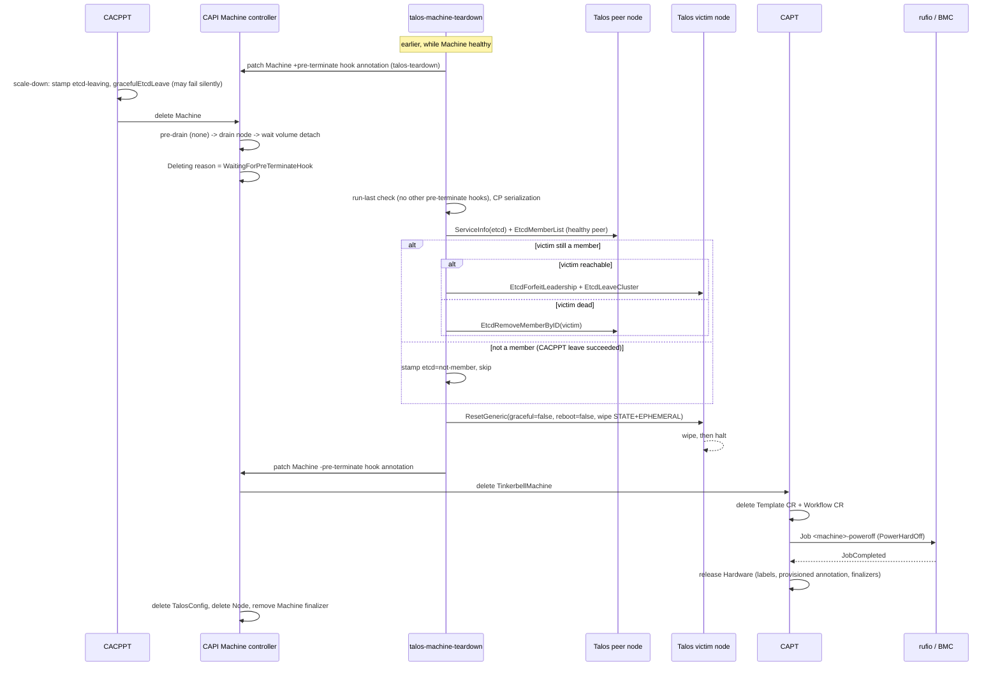

# talos-machine-teardown (C3)

Status: Proposed — 2026-09-01

talos-machine-teardown is a hook-implementing controller that gives every CAPI Machine deletion path a
`talosctl`-like teardown — etcd membership removal for control-plane nodes and a Talos `Reset` (wipe
`STATE` + `EPHEMERAL`, then halt) for all nodes — strictly before CAPT powers the hardware off. It uses
the only CAPI-native, non-topology, blocking extension point available in this environment: the
`pre-terminate.delete.hook.machine.cluster.x-k8s.io/<name>` Machine annotation, mirroring the
KubeadmControlPlane `kcp-cleanup` precedent. Today, CAPT's delete path is Template/Workflow CR deletion,
one rufio `PowerHardOff` job, and hardware release — no etcd leave, no reset, no wipe
(cluster-api-provider-tinkerbell controller/machine/scope.go:292-368), and CACPPT's graceful etcd leave
exists only on its own scale-down path and cannot be trusted as proof of completion. C3 closes that gap
for every path: scale-down, `kubectl delete machine`, MachineHealthCheck remediation, worker deletion,
and whole-cluster delete.

## Purpose and scope

- Stamp the pre-terminate hook annotation on every qualifying Machine at earliest reconcile, while the
  Machine is healthy.
- At the pre-terminate checkpoint of Machine deletion, run a verify-then-act etcd membership removal
  (control-plane machines only), then a Talos `Reset` with bounded retries, then remove the annotation
  to release the CAPI Machine controller.
- Degrade visibly and fail open on every dependency failure: a dead node, a missing secret, or an
  unreachable etcd never parks a deletion forever.

Out of scope (owned elsewhere): Hardware hygiene after release (C4), Node object deletion (CAPI machine
controller and CACPPT), in-place updates and config apply (CABPT/CACPPT, governing fact F3), schematic
resolution (CAPT, F2). Cross-component contracts live in docs/architecture.md.

## Context

This component exists because governing fact F1 rules out Runtime SDK lifecycle hooks (no ClusterClass;
`BeforeClusterDelete` never fires) and F4 documents the teardown gap; the machine deletion phase hooks
are implemented in the core Machine controller with no topology or feature-gate dependency
(cluster-api@v1.13.0 internal/controllers/machine/machine_controller.go:591-605). The pre-terminate slot
is unoccupied — CAPT greps clean for any deletion-hook annotation — and ordering is proven: CAPT teardown
begins only at `TinkerbellMachine.deletionTimestamp`, which CAPI sets strictly after all pre-terminate
hooks clear (F4). Preconditions that apply: P6 (hostname == hardware name convention, which the
hostname-to-etcd-member matching leans on) and P5 (the CACPPT `leaveErr` bug, which shapes the etcd
design below). See docs/architecture.md for the governing facts, ownership matrix, and preconditions.

## Contracts

### Reads

| Object (apiVersion) | Fields | Owner |
| --- | --- | --- |
| `Machine` (cluster.x-k8s.io/v1beta2) | `metadata.deletionTimestamp`, `metadata.annotations` (all `pre-terminate.delete.hook.machine.cluster.x-k8s.io/*` keys; `controlplane.cluster.x-k8s.io/etcd-leaving` as a hint), `metadata.labels` (`cluster.x-k8s.io/cluster-name`, `cluster.x-k8s.io/control-plane`), `spec.bootstrap.configRef.kind`, `spec.infrastructureRef.{kind,name}`, `status.conditions[Deleting]`, `status.nodeRef.name`, `status.addresses` | CAPI Machine controller; CACPPT (CP machines) |
| `Cluster` (cluster.x-k8s.io/v1beta2) | `metadata.deletionTimestamp` | CAPI |
| `TinkerbellMachine` (infrastructure.cluster.x-k8s.io/v1beta2) | `status.addresses`, `status.targetNamespace`, `spec.hardwareName` | CAPT |
| `Hardware` (tinkerbell.org/v1alpha1) | `spec.interfaces[0].dhcp.ip.address` | discovery controller / terraform |
| Secret `<cluster>-talosconfig` | key `talosconfig` | CABPT (endpoints refreshed each reconcile); terraform base chart seeds it |

### Writes

| Object | Field | Mechanism / field manager |
| --- | --- | --- |
| `Machine` | annotations listed below | cluster-api `patch.Helper` (two-way merge patch; disjoint keys cannot clobber sibling annotations), field owner `talos-machine-teardown` |
| Secret `talosconfig-<cluster-ns>-<cluster>` (C3's own namespace) | whole object (cached talosconfig) | Create/Update, field owner `talos-machine-teardown` (fully owned object; SSA adds nothing here) |
| Events on `Machine` | reasons listed below | event recorder `talos-machine-teardown` |

Annotation writes on Machines deliberately use the CAPI patch helper, not SSA: annotation-level merge
patches are the KCP/CACPPT precedent, disjoint keys cannot clobber sibling annotations
(`etcd-leaving`, `update-in-progress`, other hooks), and an SSA Apply of a Machine would have to assert
object shape C3 does not own. The repo-wide SSA-manager naming standard still applies to the one object
C3 fully owns (the cached secret).

Annotations owned by C3 (exact keys):

- `pre-terminate.delete.hook.machine.cluster.x-k8s.io/talos-teardown` = `talos-machine-teardown` — the
  CAPI hook (foreign-contract key per the naming standard; the `talos-teardown` suffix is stable across
  component renames).
- `teardown.tinkerbell.org/pre-terminate-observed-at` = RFC3339 — stamped once when C3 first observes
  the pre-terminate wait; the basis for all deadline math (survives controller restarts).
- `teardown.tinkerbell.org/etcd` = `not-member` | `left` | `removed` | `orphaned` | `skipped-cluster-delete`
  — etcd phase conclusion marker (idempotency across restarts, post-mortem trail).
- `teardown.tinkerbell.org/reset` = `done` | `skipped-timeout` | `skipped-no-address` — reset phase
  conclusion marker.

Event reasons owned: `TeardownHookStamped` (first stamp only), `EtcdMemberLeft`, `EtcdMemberRemoved`,
`EtcdMemberOrphaned`, `EtcdSkippedClusterDelete`, `TalosResetSucceeded`, `TalosResetSkipped`,
`TeardownComplete`, `TeardownCredentialsCached`, `TeardownCredentialsMissing`. C3 writes no conditions
on foreign objects (Machine conditions are CAPI-owned); health is surfaced via events, metrics, and logs.

Talos API operations (against workload nodes, not the management API server): `ServiceInfo("etcd")`,
`EtcdMemberList`, `EtcdForfeitLeadership`, `EtcdLeaveCluster` (dialed at the victim),
`EtcdRemoveMemberByID` (dialed at a healthy peer), `ResetGeneric` (dialed at the victim).

## Design

### Qualification predicate

A Machine qualifies if and only if:

- `spec.bootstrap.configRef.kind == "TalosConfig"` (group `bootstrap.cluster.x-k8s.io`), and
- `spec.infrastructureRef.kind == "TinkerbellMachine"` (group `infrastructure.cluster.x-k8s.io`).

Both control-plane and worker Machines qualify (workers get the reset half; no workers exist in the
deployed environment today, but the design covers them). Machines of any other provider pair are ignored
permanently — C3 must never park a deletion it cannot service.

### Annotation stamping flow

At every reconcile of a qualifying Machine:

1. `deletionTimestamp` unset and hook absent: add
   `pre-terminate.delete.hook.machine.cluster.x-k8s.io/talos-teardown: talos-machine-teardown` via
   patch helper. Idempotent — presence check first; re-stamping an existing key is a no-op patch that is
   never sent.
2. `deletionTimestamp` set and hook absent (late stamp): stamp only if the `Deleting` condition is
   absent (machine controller has not processed the deletion yet) or its reason is a phase at or before
   the pre-terminate wait (`WaitingForPreDrainHook`, draining, volume detach,
   `WaitingForPreTerminateHook`). If the reason shows infra deletion or later has begun
   (`WaitingForInfrastructureDeletion` onward), do NOT stamp: `reconcileDelete` re-evaluates the
   pre-terminate gate on every pass (machine_controller.go:591-605), so a late annotation would park a
   Machine whose power-off has already started. This Machine takes the legacy teardown path (documented
   window, below).
3. Legacy-suffix cleanup: any hook annotation under the CAPI prefix whose value is
   `talos-machine-teardown` but whose key suffix is not `talos-teardown` (a pre-rename leftover) is
   removed in the same patch that adds the current key.

### Pre-terminate state machine

Reconcile of a qualifying Machine with `deletionTimestamp` set and our hook present:

1. **Detect the phase.** Require Machine condition `Deleting` == `True` with reason
   `WaitingForPreTerminateHook` (`clusterv1.MachineDeletingWaitingForPreTerminateHookReason`,
   machine_controller.go:601-603). Not there yet (pre-drain, draining, volume detach) → return; the
   Machine watch re-triggers on the condition transition. Never act early: acting during drain would
   kill the node while CAPI still needs its kubelet.
2. **Run-last discipline** (mirrors KCP `reconcilePreTerminateHook`,
   controlplane/kubeadm/internal/controllers/controller.go:1362-1370, and the machine controller's
   kcp-cleanup exemptions at machine_controller.go:670-696): if the Machine carries any OTHER
   `pre-terminate.delete.hook.machine.cluster.x-k8s.io/*` annotation, requeue after 15s. C3's work
   stops the kubelet and etcd; other hooks must run while the node is still alive.

   > **Decision:** apply run-last unconditionally, without KCP's Kubernetes `>= v1.31` version gate.
   > The gate exists upstream only to limit blast radius on old clusters; this fleet runs modern
   > versions, and no other pre-terminate hook exists in the environment today, so the check is
   > usually a no-op.

3. **Record phase entry.** Stamp `teardown.tinkerbell.org/pre-terminate-observed-at` (RFC3339, now) if
   absent. All deadlines below are measured from this timestamp so restarts do not reset the clock.
4. **Mode select.** Fetch the owning `Cluster` (by `cluster.x-k8s.io/cluster-name` label). If
   `Cluster.deletionTimestamp` is set, or the Cluster is NotFound, enter cluster-delete mode: stamp
   `teardown.tinkerbell.org/etcd: skipped-cluster-delete`, emit `EtcdSkippedClusterDelete`, go to
   step 8.

   > **Decision — "final quorum" detection.** The final quorum is the entire remaining etcd member set
   > at the moment cluster deletion begins, and it is detected purely by `Cluster.deletionTimestamp`
   > (or Cluster already gone): CACPPT's `reconcileDelete` deletes all CP Machines concurrently
   > (cluster-api-control-plane-provider-talos controllers/taloscontrolplane_controller.go:287-321),
   > so every CP Machine of a deleting Cluster is part of the final quorum and C3 performs NO etcd
   > membership operations in this mode — not even for the first machines to reach pre-terminate.
   > Rationale: (a) serial leaves against a collapsing cluster shrink quorum while the remaining
   > members are themselves parked at pre-terminate, risking a wedged half-torn-down etcd; (b) every
   > peer is deleting, so no "healthy peer" exists by definition; (c) the terraform bootstrap node is
   > an etcd member with no Machine object (terraform `replicas = n-1`), so member-count-based
   > "last member" detection is impossible from CAPI state; (d) the reset wipe destroys member state
   > anyway. Pre-terminate hooks still gate infra deletion during cluster delete even though
   > pre-drain/drain are skipped (F4; `isDeleteNodeAllowed` fails with `errClusterIsBeingDeleted`
   > while the pre-terminate wait at machine_controller.go:591 is unconditional), so the reset in
   > step 8 still runs.

5. **Branch select.** No `cluster.x-k8s.io/control-plane` label → worker: go to step 8.
6. **CP serialization.** List CP Machines of the cluster. If another CP Machine holding our hook has an
   older `deletionTimestamp`, requeue after 15s — one etcd operation at a time per cluster, oldest
   first, mirroring KCP's deterministic oldest-deletionTimestamp pick (controller.go:1351-1354).
7. **etcd branch — verify-then-act.** Skip the whole step if `teardown.tinkerbell.org/etcd` is already
   set. Otherwise:

   1. Build the victim's hostname candidate set (matching rules below).
   2. Select a healthy peer and call `EtcdMemberList` through it.

      > **Decision — healthy peer selection.** A healthy peer is a Machine of the same cluster that:
      > carries `cluster.x-k8s.io/control-plane`; is not the victim; has no `deletionTimestamp`; does
      > not carry `controlplane.cluster.x-k8s.io/etcd-leaving` (it may be mid-leave); and answers, at
      > its resolved address within the per-call timeout, `ServiceInfo("etcd")` with last event state
      > `Running` and health healthy. Candidates are tried in order (NodeRef-holders first, then oldest
      > first) until one also answers `EtcdMemberList`; the first success is the peer. This mirrors
      > CACPPT's `designatedCPMachine` selection (controllers/etcd.go:188-203) but deliberately does
      > NOT adopt auditEtcd's "bail if ANY machine lacks a NodeRef" rule (etcd.go:181-187) — C3 needs
      > exactly one healthy peer, not a fully-settled fleet, so it stays available in precisely the
      > half-broken states auditEtcd gives up on.

      No healthy peer reachable: requeue with backoff while within the etcd deadline; on expiry, stamp
      `teardown.tinkerbell.org/etcd: orphaned`, emit warning `EtcdMemberOrphaned`, and proceed to
      step 8 (fail open). Residual: CACPPT's `auditEtcd` force-removes orphaned members later, once all
      CP machines have NodeRefs (etcd.go:148-258).
   3. Victim not in the member list → stamp `teardown.tinkerbell.org/etcd: not-member`, go to step 8.
      This is the common case after a CACPPT scale-down whose graceful leave succeeded, and it makes
      double-leave impossible by construction.
   4. Victim still a member and reachable via the Talos API (dial the victim; `ServiceInfo("etcd")`
      succeeds): unless the `etcd-leaving` hint is present, call `EtcdForfeitLeadership` via the victim
      (best-effort; a failure is logged and does not block); then `EtcdLeaveCluster` via the victim.
      Success → stamp `teardown.tinkerbell.org/etcd: left`, emit `EtcdMemberLeft`, go to step 8.
      Failure → fall through to 7.5.
   5. Victim unreachable, or leave-via-victim failed: `EtcdRemoveMemberByID` via the healthy peer using
      the member ID from step 7.2. Success → stamp `teardown.tinkerbell.org/etcd: removed`, emit
      `EtcdMemberRemoved`, go to step 8. Failure → requeue with backoff; on etcd deadline expiry take
      the `orphaned` path of 7.2.

   The CACPPT `etcd-leaving` annotation is strictly a hint (skip the leadership-forfeit nicety in 7.4),
   NEVER proof the member is gone. The overlap critique's verified finding, which this design encodes:
   "the annotation is stamped BEFORE `gracefulEtcdLeave` runs (it means 'leave attempted/in-progress',
   deliberately, to survive mid-reconcile crashes) and a failed leave is silently swallowed by the known
   latent bug (returns the nil `err` instead of `leaveErr`)". In code: the annotation is patched at
   controllers/scale.go:145-154, `gracefulEtcdLeave` runs after it at scale.go:156, and scale.go:163-165
   reads `if leaveErr != nil { return ctrl.Result{}, err }` — `err` is already nil from the successful
   `Client.Delete`, so a failed leave returns success. Exactly in the failure case C3 exists to cover —
   annotation stamped, leave failed silently, Machine deleted — trusting the annotation would reproduce
   the gap. Verify-then-act (7.2/7.3) makes the annotation's truthfulness irrelevant: membership is
   always re-checked against a live peer, and a completed leave is detected as `not-member`.

8. **Reset branch.** Skip if `teardown.tinkerbell.org/reset` is already set. Otherwise:

   1. Resolve the victim's address (fallback chain below). Empty chain → stamp
      `teardown.tinkerbell.org/reset: skipped-no-address`, emit `TalosResetSkipped`, go to step 9
      immediately (a node with no address anywhere never booted; there is nothing to wipe).
   2. Dial Talos (credentials below; endpoint and node = the resolved address) and call:

      ```go
      c.ResetGeneric(ctx, &machineapi.ResetRequest{
          Graceful: false,
          Reboot:   false,
          SystemPartitionsToWipe: []*machineapi.ResetPartitionSpec{
              {Label: "STATE", Wipe: true},
              {Label: "EPHEMERAL", Wipe: true},
          },
      })
      ```

      (`ResetGeneric` at talos/pkg/machinery@v1.13.0/client/client.go:315; request fields at
      api/machine/machine.pb.go:1976-1992.) Rationale: `Graceful: false` because graceful reset makes
      the node itself leave etcd and enforce etcd health checks first ("Graceful indicates whether node
      should leave etcd before the upgrade", machine.pb.go:1978-1980) — CAPI already drained the node
      (or deliberately skipped drain on cluster delete) and etcd membership was handled explicitly in
      step 7, so a graceful reset would double-leave or hang on a node whose member was already removed
      via a peer. `Reboot: false` halts after the wipe instead of rebooting, which avoids the netboot
      race: a rebooting, wiped machine would PXE and could start an auto-enrollment workflow before
      CAPT's rufio `PowerHardOff` lands. Wiping `STATE` + `EPHEMERAL` destroys the machine config
      (secrets), etcd data, and all local data — the security-relevant state — while leaving the
      partition table for the next full provisioning workflow (CAPT clears the provisioned annotation
      on release, so the next claim re-images regardless).
   3. Success (API acknowledged) → stamp `teardown.tinkerbell.org/reset: done` (its own patch, so a
      crash after the ack never re-resets a halted node), emit `TalosResetSucceeded`, go to step 9.
   4. Failure (unreachable, TLS, timeout): requeue with backoff while within the reset deadline; on
      expiry stamp `teardown.tinkerbell.org/reset: skipped-timeout`, emit warning `TalosResetSkipped`,
      and proceed. Documented residual: a dirty disk. It is covered at next provision — release clears
      the provisioned annotation so the workflow re-images the disk, and the rendered machine config
      carries `install.wipe: true` (terraform strategic patch,
      tfc/cluster-bootstrap/modules/data-lookup/modules/config-patches/locals.tf) — but the stale
      config and etcd data sit on the powered-off disk until then; C4 handles the Hardware-side
      (`userData`) half of that exposure.

9. **Release.** Remove `pre-terminate.delete.hook.machine.cluster.x-k8s.io/talos-teardown` via patch
   helper (final act; a separate patch from 8.3), emit `TeardownComplete`. The CAPI Machine controller
   proceeds: deletes the TinkerbellMachine → CAPT deletes Template + Workflow CRs, runs the rufio
   `PowerHardOff` job, releases the Hardware → CAPT finalizer removed → CAPI deletes the TalosConfig
   and the Node, removes the Machine finalizer.

> **Decision — timeout and retry defaults.** Per-call Talos timeouts: 10s for etcd operations (double
> CACPPT's 5s, for BMC-class SBC hardware), 30s for `ResetGeneric`. Requeue backoff on failure: 5s
> initial, doubling to a 30s cap. Phase deadlines, measured from `pre-terminate-observed-at`:
> `--etcd-timeout` default `2m`, `--reset-timeout` default `5m` (the reset clock includes the etcd
> phase; a dead node therefore delays its own deletion by at most ~5m). KCP never times out its hook;
> C3 deliberately bounds both phases because the charter's fail-open philosophy demands that a dead
> node not park deletion (MHC remediation of dead nodes must converge), and both degradations have
> named residual covers (auditEtcd; re-provision wipe + C4).

### Hostname-to-etcd-member matching

Mirrors CACPPT `auditEtcd` (controllers/etcd.go:220-246), extended for never-joined nodes:

1. Candidate 1: `Machine.status.nodeRef.name`, overridden by the first `status.addresses` entry of type
   `MachineHostName` when present (etcd.go:228-236).
2. Candidate 2 (C3 extension, for machines with no NodeRef): `Machine.spec.infrastructureRef.name` —
   under P6 and CABPT `hostname.source: InfrastructureName`, the TinkerbellMachine name IS the hostname
   (== hardware name). Candidate 3: `Machine.metadata.name` (covers `hostname.source: MachineName`).
3. Each candidate and each `member.Hostname` are truncated at the first `.` (FQDN trim) and compared
   case-insensitively (`strings.EqualFold`), exactly as etcd.go:238-241. A member matching ANY
   candidate is the victim's member. Names are unique per cluster by CABPT construction, so multiple
   candidates cannot match different members.

### Address resolution fallback chain

Used for both the victim and peer candidates:

1. `Machine.status.addresses` — first `InternalIP`/`ExternalIP` entry (CACPPT's
   `talosconfigForMachines` pattern, controllers/configs.go:86-90).
2. `TinkerbellMachine.status.addresses` (via `spec.infrastructureRef`) — populated from the Hardware
   DHCP IP at claim time (CAPT controller/machine/hardware.go:62-85), present even for machines that
   never joined the cluster, whose `Machine.status.addresses` is empty.
3. `Hardware.spec.interfaces[0].dhcp.ip.address` — looked up via `TinkerbellMachine.spec.hardwareName`
   in `TinkerbellMachine.status.targetNamespace`; covers a TinkerbellMachine whose status was never
   populated.

### Credentials

Normal path: read Secret `<cluster>-talosconfig` (key `talosconfig`) from the Machine's namespace —
CACPPT's exact access pattern (controllers/configs.go:71-84).

> **Decision — cache mechanism for the cluster-delete GC race.** At hook-stamp time (and refreshed on
> any later reconcile of a non-deleting qualifying Machine where the source `resourceVersion` changed),
> C3 copies the secret into a component-owned Secret `talosconfig-<cluster-ns>-<cluster>` in C3's OWN
> deployment namespace, labeled `teardown.tinkerbell.org/cluster-name` and
> `teardown.tinkerbell.org/cluster-namespace`, with no owner references. Living outside the cluster's
> namespace and ownership graph, the copy survives Cluster finalization and any owner-reference GC of
> `<cluster>-talosconfig` during whole-cluster delete. Reads prefer the live secret and fall back to
> the cache (`TeardownCredentialsMissing` event when both are gone — teardown then degrades to the
> timeout paths). Cleanup: the cached secret is deleted when the Cluster no longer exists AND no
> qualifying Machine of that cluster remains; a periodic sweep (and one at startup) garbage-collects
> strays. The copy holds cluster-admin Talos client credentials; the chart documents that C3's
> namespace must be treated with the same sensitivity as the CAPI cluster namespace.

### Ordering, races, idempotency

- **Strictly before power-off**: proven by F4 — the pre-terminate wait precedes
  `reconcileDeleteInfrastructure` (machine_controller.go:591-611), and CAPT acts only on
  `TinkerbellMachine.deletionTimestamp`.
- **No CACPPT deadlock**: CACPPT's etcd health check excludes machines with a `deletionTimestamp` or
  the `etcd-leaving` annotation (controllers/etcd.go:26-31), so a Machine parked at pre-terminate does
  not wedge CACPPT reconciliation; `auditEtcd` counts deleting machines with NodeRefs in its match set,
  so no force-removal races C3's graceful leave.
- **Double-leave safety**: verify-then-act makes any combination of CACPPT-leave/C3-leave idempotent —
  membership is re-verified via a peer before every action, and `not-member` short-circuits.
- **Crash safety**: every phase conclusion is persisted as an annotation before the next phase begins;
  `pre-terminate-observed-at` anchors deadlines across restarts; the reset ack is recorded before the
  hook is removed so a crash between the two patches skips the reset on replay instead of dialing a
  halted node.
- **Annotation-key disjointness**: `pre-terminate.../talos-teardown`, `etcd-leaving`,
  `update-in-progress`, and `teardown.tinkerbell.org/*` are disjoint keys written via merge patches;
  no writer can clobber another (confirmed by the overlap critique).
- **No post-release re-stamp** (as implemented): after release, the Machine's `Deleting` condition can
  still read `WaitingForPreTerminateHook` until the machine controller's next pass; the late-stamp path
  therefore refuses to re-stamp whenever the reset conclusion annotation is present, breaking the
  stamp → short-circuit → release → watch-event loop.
- **Small deviations recorded** (as implemented, each safe): the Hardware lookup falls back to the
  TinkerbellMachine's own namespace when `status.targetNamespace` is empty; a machine whose etcd phase
  already concluded skips the CP serialization hold (the one-etcd-op-per-cluster invariant still
  holds); a reachable victim whose etcd is already `Finished` goes straight to removal-via-peer rather
  than attempting a doomed leave; the run-last check ignores pre-terminate keys carrying this
  controller's own value (pre-rename leftovers, swept in the release patch); per-RPC timeouts are
  genuinely per RPC (fresh context per call).

### Sequence diagram — CP machine delete, end to end



## Failure modes and degradation

| Dependency / situation | Behavior |
| --- | --- |
| C3 not deployed or down at Machine creation AND deletion (unstamped fast-delete window) | Machine is never annotated → legacy teardown (power-off only). C4 still clears `userData` and os metadata after release. Documented, accepted. |
| C3 down while an annotated Machine deletes | Deletion parks at pre-terminate indefinitely — the same trade-off KCP accepts for `kcp-cleanup` (the machine controller never times out hooks by design). Operator escape hatch: `kubectl annotate machine <name> pre-terminate.delete.hook.machine.cluster.x-k8s.io/talos-teardown-`. The chart README documents it. |
| No healthy peer (single CP machine + terraform bootstrap node, or all peers deleting) | etcd phase times out (2m) → `orphaned`, proceed. Residual member cleaned by CACPPT `auditEtcd` once NodeRefs settle. Known topology limitation: with `replicas: 1` the only possible peer is the bootstrap node, which has no Machine — orphaned path is guaranteed; see open questions. |
| Victim dead (MHC remediation case) | etcd removal via peer (`EtcdRemoveMemberByID`); reset times out (5m) → `skipped-timeout`, proceed; dirty disk covered by next-provision `install.wipe: true` + full re-image. |
| `<cluster>-talosconfig` and cache both missing | `TeardownCredentialsMissing` warning; etcd and reset phases run their timeout paths (fail open); deletion completes within ~5m. |
| Cluster delete | etcd skipped entirely (final-quorum decision), reset best-effort with GC-proof cached credentials; pre-drain/drain are skipped by CAPI but pre-terminate still gates (F4). |
| Machine deleted while owner Machine bookkeeping is odd (no bootstrap secret etc.) | Irrelevant to C3 — it acts on the Machine, not the TinkerbellMachine; CAPT's own delete gating (tinkerbellmachine.go:162-176) happens after C3 releases. |
| Talos API version skew | C3 pins `siderolabs/talos/pkg/machinery` v1.13.0 to match both forks; etcd/reset RPCs are stable across the supported skew. |

Nothing in C3 can deadlock another component: CACPPT health checks exclude parked machines, CAPT sees
nothing until the hook clears, and C3 itself always converges to hook removal within the bounded
deadlines once the pre-terminate phase is reached.

## RBAC

ClusterRole `talos-machine-teardown` (this component requires a ClusterRole; the repo's precedent
is namespace-scoped Roles — F9):

```yaml
rules:
  - apiGroups: ["cluster.x-k8s.io"]
    resources: ["machines"]
    verbs: ["get", "list", "watch", "patch"]
  - apiGroups: ["cluster.x-k8s.io"]
    resources: ["clusters"]
    verbs: ["get", "list", "watch"]
  - apiGroups: ["infrastructure.cluster.x-k8s.io"]
    resources: ["tinkerbellmachines"]
    verbs: ["get", "list", "watch"]
  - apiGroups: ["tinkerbell.org"]
    resources: ["hardware"]
    verbs: ["get", "list"]
  - apiGroups: [""]
    resources: ["secrets"]
    verbs: ["get", "list"]
  - apiGroups: [""]
    resources: ["events"]
    verbs: ["create", "patch"]
  - apiGroups: ["events.k8s.io"]
    resources: ["events"]
    verbs: ["create", "patch"]
```

The `events.k8s.io` rule exists because the controller uses the structured events recorder
(`manager.GetEventRecorder`), whose sink creates `events.k8s.io/v1` Events; the core-group grant covers
legacy consumers. Secrets and Hardware are read with `get`/`list` only — no `watch` — and the manager
client deliberately bypasses the cache for both types (`client.CacheOptions.DisableFor`): a cached
Secret informer would need `watch` and would hold every cluster secret in memory.

Role in C3's own namespace: `secrets` `get/list/watch/create/update/delete` (credentials cache + GC);
`coordination.k8s.io` `leases` `get/list/watch/create/update/patch/delete` (leader election); events in
both groups. The cluster-wide `secrets get` is the widest grant; the chart exposes `watchNamespace` to
scope the whole ClusterRole down to a single CAPI namespace (the deployed environment keeps everything
in `tinkerbell`).

## Deployment

Chart `helm/talos-machine-teardown` following the repo conventions (research/target-repo.json): 1-replica
Deployment (RollingUpdate is fine — no hostNetwork), leader election on
(`talos-machine-teardown.teardown.tinkerbell.org`), scratch image
`ghcr.io/tinkerbell-community/talos-machine-teardown` via a new
goreleaser build id, metrics `:8080`, probes `:8081`, runAsNonRoot 65532. No Service, no webhook, no
TLS, no cert-manager — C3 is a plain controller (F8's simplification applies fully). No CRDs.

Flags ↔ values (kebab ↔ camelCase):

| Flag | Default | Purpose |
| --- | --- | --- |
| `--etcd-timeout` | `2m` | etcd phase deadline from `pre-terminate-observed-at` |
| `--reset-timeout` | `5m` | reset phase deadline from `pre-terminate-observed-at` |
| `--etcd-call-timeout` | `10s` | per Talos etcd RPC |
| `--reset-call-timeout` | `30s` | per `ResetGeneric` RPC |
| `--watch-namespace` | `""` (all) | restrict cache + RBAC scope |
| `--cache-namespace` | `POD_NAMESPACE` | namespace holding the cached talosconfig secrets (the controller's own) |
| `--concurrency` | `4` | max concurrent reconciles (CP etcd work is serialized per cluster logically) |
| `--leader-elect`, `--metrics-bind-address`, `--health-probe-bind-address`, `--log-level`, `--log-format` | repo defaults | as in the discovery controller |

## Implementation plan

Packages (single module, per the naming standard): `cmd/talos-machine-teardown/main.go`,
`internal/teardown/`.

Key types and functions:

```go
// internal/teardown/hook.go
const (
    HookAnnotation = clusterv1.PreTerminateDeleteHookAnnotationPrefix + "/talos-teardown"
    HookValue      = "talos-machine-teardown"
)

// internal/teardown/qualify.go
func Qualifies(m *clusterv1.Machine) bool
func StampAllowed(m *clusterv1.Machine) bool // deletionTimestamp/Deleting-reason gate

// internal/teardown/phase.go
func AtPreTerminate(m *clusterv1.Machine) bool          // Deleting cond reason check
func HasOtherPreTerminateHooks(m *clusterv1.Machine) bool

// internal/teardown/talos.go — narrow client seam for fakes
type Client interface {
    ServiceInfo(ctx context.Context, service string) ([]sclient.ServiceInfo, error)
    EtcdMemberList(ctx context.Context, req *machineapi.EtcdMemberListRequest) (*machineapi.EtcdMemberListResponse, error)
    EtcdForfeitLeadership(ctx context.Context, req *machineapi.EtcdForfeitLeadershipRequest) (*machineapi.EtcdForfeitLeadershipResponse, error)
    EtcdLeaveCluster(ctx context.Context, req *machineapi.EtcdLeaveClusterRequest) error
    EtcdRemoveMemberByID(ctx context.Context, req *machineapi.EtcdRemoveMemberByIDRequest) error
    ResetGeneric(ctx context.Context, req *machineapi.ResetRequest) error
    Close() error
}
type ClientFactory func(cfg *talosconfig.Config, endpoint string) (Client, error)

// internal/teardown/etcd.go
type EtcdOutcome string // NotMember | Left | Removed | Orphaned
func (r *Reconciler) ensureEtcdRemoved(ctx context.Context, cl *clusterv1.Cluster,
    victim *clusterv1.Machine, peers []clusterv1.Machine) (EtcdOutcome, ctrl.Result, error)
func hostnameCandidates(m *clusterv1.Machine) []string
func matchesMember(candidates []string, memberHostname string) bool // FQDN-trim + EqualFold

// internal/teardown/address.go
func (r *Reconciler) resolveAddress(ctx context.Context, m *clusterv1.Machine) (string, error)

// internal/teardown/credentials.go
type CredentialCache struct{ Client client.Client; Namespace string }
func (c *CredentialCache) Ensure(ctx context.Context, clusterKey client.ObjectKey) error
func (c *CredentialCache) Get(ctx context.Context, clusterKey client.ObjectKey) (*talosconfig.Config, error)
func (c *CredentialCache) GC(ctx context.Context) error
```

Controller wiring: `For(&clusterv1.Machine{})` with a predicate admitting Machines that qualify or
already carry the hook; `Watches(&clusterv1.Cluster{})` mapped to that cluster's qualifying Machines
(predicate: deletionTimestamp transition — flips machines into cluster-delete mode);
`Watches(&tinkv1beta2.TinkerbellMachine{})` mapped to the owner Machine (addresses appearing late).
Peer listing uses cache-backed label-selector lists on `cluster.x-k8s.io/cluster-name` +
`cluster.x-k8s.io/control-plane`; no field indexes needed. Scheme: clientgoscheme + cluster-api core
v1beta2 + tinkerbell api. Pins: `sigs.k8s.io/cluster-api` v1.13.0 and
`siderolabs/talos/pkg/machinery` v1.13.0 to match the forks (F7).

> **Decision (as implemented) — TinkerbellMachine is read as unstructured.** Only three fields are
> needed (`status.addresses`, `status.targetNamespace`, `spec.hardwareName`), and importing the CAPT
> fork's `api` module would force a `replace` directive on every consumer of this module (the fork's
> v1beta2 types are not published under the upstream module path) — the same trade-off
> talos-upgrade-coordinator records for `TalosControlPlane`. The unstructured watch is mapped to the
> owner Machine via owner references.

Milestones:

- **M1**: qualification + stamping + release + worker reset path + address chain + credentials
  (live-only). Envtest: stamp idempotency, late-stamp gating by Deleting reason, hook removal.
- **M2**: CP etcd verify-then-act — peer selection, member matching, leave-via-victim,
  remove-via-peer, per-cluster serialization. Fake Talos client with scripted member lists and
  reachability; table-driven branch coverage (member+reachable, member+dead, not-member, no-peer,
  etcd-leaving-hint present with failed prior leave).
- **M3**: cluster-delete mode + credential cache/GC + deadline paths (`orphaned`,
  `skipped-timeout`, `skipped-no-address`) with a fake clock.
- **M4**: run-last discipline, metrics (`teardown_machines_total`,
  `teardown_etcd_total{outcome}`, `teardown_reset_total{outcome}`, `teardown_reset_duration_seconds`),
  chart + goreleaser entries,
  hardware validation on the fleet (halt semantics, timings), docs.

Test strategy: unit tests for pure functions (matching, qualification, phase detection); scenario
tests against the controller-runtime fake client, writing Machine `status.conditions` directly to
simulate the machine controller's phases; the fake `Client` behind `ClientFactory` scripts a node
fleet and asserts exact call sequences (e.g. no `EtcdForfeitLeadership` when the hint is present, no
etcd calls in cluster-delete mode); idempotency tests replay reconciles after phase conclusions and
verify no Talos re-dials. (As implemented: the fake client suffices here — unlike C0, C3's Machine
writes are annotation merge patches with no SSA field-ownership semantics to distrust; envtest with
the CAPI CRDs remains an option for the M4 hardware-validation milestone.)

## Non-goals

- No Hardware writes of any kind — `userData`/os-metadata/netboot hygiene is C4's, on release.
- No Node object deletion — CAPI's machine controller (post-infra) and CACPPT's scale-down own it.
- No Runtime SDK hooks, no ExtensionConfig (F1, F8); no in-place update participation (F3).
- No BMC/power actions — CAPT + rufio own power; C3 halts via the OS only.
- No CACPPT changes — the scale.go:163-165 `leaveErr` fix is recommended (P5) but C3 is correct with
  or without it.
- No MachinePool support (none exist; the deletion-hook contract excludes them anyway).

## Open questions

- Halt semantics on the fleet's SBC hardware: does `Reset` with `Reboot: false` reliably halt Pi-class
  boards, or does firmware auto-restart on some of them (re-opening a small netboot window before
  CAPT's power-off)? M4 hardware validation decides whether to keep `reboot=false` or pair it with an
  earlier rufio interlock recommendation.
- Single-CP topology: should the healthy-peer candidate set be extended with the endpoints already
  listed inside the `<cluster>-talosconfig` itself (which could reach the terraform bootstrap node) so
  the `replicas: 1` case gets etcd membership removal instead of the guaranteed `orphaned` path?
  Deferred: it blurs the "peers are Machines" invariant and the bootstrap node is terraform-owned.
- Should `teardown.tinkerbell.org/*` bookkeeping annotations be mirrored as a metric-labeled
  terminal event on the Cluster for fleet-level post-mortems, given the Machine object disappears
  shortly after teardown concludes?
